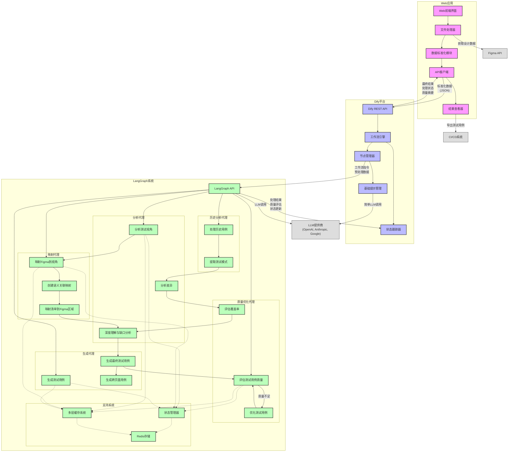

# LangGraph Agent Workflow for Figma Test Case Generation

## System Overview



LangGraph Workflow is an advanced agent-based system for generating high-quality, structured test cases from Figma design files. The system leverages a directed acyclic graph (DAG) of specialized LLM agents, each responsible for a specific step in the test case generation and optimization process. It integrates multiple LLM providers (OpenAI, Anthropic, Google Gemini) and implements a feedback-driven optimization loop to ensure test case quality and coverage.

**Core Capabilities:**

- **Multi-agent Orchestration**: Coordinated agents for specialized tasks in the test generation pipeline
- **Quality Assessment & Optimization**: Automated multi-dimensional quality evaluation and iterative refinement
- **Semantic Correlation Mapping**: Deep understanding of relationships between design elements and test criteria
- **Historical Test Analysis**: Learning from previous test cases to improve generation quality
- **Multi-language Support**: Full Japanese and English localization throughout the system
- **Intelligent Caching**: Multi-level caching strategy to optimize performance and reduce costs

## Architecture Design

### System Architecture

The system follows a modular agent-based architecture with the following key components:

1. **Agent Nodes**: Specialized LLM-powered agents for specific tasks in the workflow
2. **State Management**: Redis-based persistent state management for workflow execution
3. **Workflow Engine**: LangGraph-based directed graph for orchestrating agent interactions
4. **API Layer**: FastAPI-based HTTP interface for service integration
5. **Caching System**: Multi-level intelligent caching for performance optimization
6. **Configuration System**: Flexible configuration for LLM providers, models, and parameters

### Agent Composition

The system comprises specialized agents organized in a directed workflow:

1. **Analysis Agents**
   - `analyze_viewpoints_modules`: Analyzes test viewpoint structures and relationships
   - `deep_understanding_and_gap_analysis`: Performs comprehensive analysis to identify testing gaps
   - `analyze_differences`: Analyzes differences between current design and historical test patterns

2. **Mapping Agents**
   - `map_figma_to_viewpoints`: Maps Figma components to relevant test viewpoints
   - `map_checklist_to_figma_areas`: Maps test checklists to specific Figma design areas
   - `create_semantic_correlation_map`: Creates semantic relationships between components and test criteria

3. **Generation Agents**
   - `generate_testcases`: Generates component-level test cases
   - `generate_final_testcases`: Produces final structured test cases with context
   - `generate_cross_page_case`: Creates test cases spanning multiple pages/flows

4. **Quality Optimization Agents**
   - `evaluate_testcase_quality`: Assesses test case quality across multiple dimensions
   - `optimize_testcases`: Improves test cases based on quality assessment feedback
   - `evaluate_coverage`: Evaluates test coverage across components and scenarios

5. **Historical Analysis Agents**
   - `process_historical_cases`: Processes historical test cases for pattern extraction
   - `extract_test_patterns`: Identifies patterns from historical test cases

### Workflow Design

The system implements two primary workflow paths:

1. **Standard Workflow**:

   ```
   analyze_viewpoints_modules → map_figma_to_viewpoints → create_semantic_correlation_map →
   map_checklist_to_figma_areas → validate_test_purpose_coverage → 
   deep_understanding_and_gap_analysis → generate_final_testcases → 
   evaluate_testcase_quality → [optimize_testcases → evaluate_testcase_quality]* → END
   ```

2. **Historical-Enhanced Workflow**:

   ```
   process_historical_cases → extract_test_patterns → analyze_viewpoints_modules →
   map_figma_to_viewpoints → create_semantic_correlation_map → map_checklist_to_figma_areas →
   validate_test_purpose_coverage → analyze_differences → evaluate_coverage →
   deep_understanding_and_gap_analysis → generate_final_testcases →
   evaluate_testcase_quality → [optimize_testcases → evaluate_testcase_quality]* → END
   ```

The quality optimization loop (`[optimize_testcases → evaluate_testcase_quality]*`) runs iteratively until quality thresholds are met or maximum retry limits are reached.

## Core Algorithms

### Test Case Quality Assessment

The system implements a multi-dimensional quality assessment algorithm that evaluates test cases across four key dimensions:

1. **Completeness (30% weight)**
   - Presence of all required fields (ID, module, viewpoint, priority, category)
   - Completeness of test steps (step number, description, expected result)
   - Presence of preconditions and test data

2. **Precision (30% weight)**
   - Specificity of test step descriptions
   - Clarity of operation targets and methods
   - Actionable detail level for test execution

3. **Executability (20% weight)**
   - Clarity of preconditions
   - Specificity of expected results for each step
   - Clarity of test data requirements

4. **Coverage (20% weight)**
   - Alignment with test viewpoints
   - Inclusion of boundary condition tests
   - Inclusion of error scenario tests

The quality assessment produces a normalized score (0.0-1.0) and generates specific improvement suggestions for each test case.

### Test Case Optimization Algorithm

The optimization process uses a feedback-driven approach:

1. **Quality Evaluation**: Assess test case quality across multiple dimensions
2. **Targeted Improvement**: Generate specific improvement suggestions for low-quality test cases
3. **LLM-based Refinement**: Use specialized LLM prompts to improve test cases while maintaining structure
4. **Quality Re-assessment**: Evaluate optimized test cases to verify improvements
5. **Iterative Refinement**: Repeat the process until quality thresholds are met or retry limits reached

The system implements a retry controller that manages the optimization loop based on configurable parameters:

- Maximum retry attempts
- Quality threshold for triggering retries
- Retry delay with exponential backoff

### Semantic Correlation Mapping

The system creates deep semantic relationships between design elements and test criteria:

1. **Component-Test Criterion Mapping**: Maps UI components to applicable test criteria
2. **Navigation-Scenario Mapping**: Maps navigation paths to test scenarios
3. **Criterion-Pattern Mapping**: Maps test criteria to historical test patterns
4. **Context-aware Relationships**: Considers component hierarchy and interaction context

This semantic mapping enables more precise test case generation by understanding the relationships between design elements, test criteria, and historical patterns.

## State Management

The system implements a comprehensive state management approach:

1. **State Definition**: Strongly typed state definition (`TestCaseState`) with all workflow variables
2. **Immutable Updates**: Functional state updates that maintain immutability
3. **Persistent Storage**: Redis-based storage for state persistence across sessions
4. **Session Management**: Support for multiple concurrent workflow sessions
5. **Intermediate Results**: Tracking of per-node results for debugging and analysis
6. **Workflow Logging**: Comprehensive logging of workflow execution steps

Key state elements include:

- Input data (Figma design, test viewpoints)
- Intermediate analysis results
- Semantic correlation maps
- Generated test cases
- Quality metrics and optimization logs
- Cache metadata

## Caching System

The system implements a multi-level intelligent caching strategy:

1. **L1 Cache**: In-memory cache for frequently accessed data (TTL: 300s)
2. **L2 Cache**: Redis-based persistent cache for common data (TTL: 3600s)
3. **L3 Cache**: Long-term storage for infrequently accessed data (TTL: 86400s)

Specialized caching is implemented for:

- LLM API calls
- Figma data processing results
- Test viewpoint parsing results
- Semantic correlation maps
- Quality assessment results

## Directory Structure

```
langgraph_workflow/
  main.py                # FastAPI entrypoint with API endpoints
  enhanced_workflow.py   # Enhanced workflow with quality optimization
  workflow.py            # Basic workflow implementation
  state_management.py    # State management and persistence
  requirements.txt       # Python dependencies
  Dockerfile             # Containerization for deployment
  config.yaml            # Configurable agent and node parameters
  config.dify-workflow.json # Dify workflow integration config
  prompt_templates.yaml  # Prompt templates and few-shot examples
  
  nodes/                 # Agent node implementations
    analyze_viewpoints_modules.py
    map_figma_to_viewpoints.py
    create_semantic_correlation_map.py
    map_checklist_to_figma_areas.py
    validate_test_purpose_coverage.py
    deep_understanding_and_gap_analysis.py
    generate_final_testcases.py
    process_historical_cases.py
    extract_test_patterns.py
    analyze_differences.py
    evaluate_coverage.py
    evaluate_testcase_quality.py
    optimize_testcases.py
    generate_cross_page_case.py
    format_output.py
    fetch_and_clean_figma_json.py
    load_page.py
    route_infer.py
    
  utils/                 # Utility modules
    llm_client.py        # Base LLM client interface
    llm_client_factory.py # LLM client factory with provider selection
    cache_manager.py     # Basic cache management
    intelligent_cache_manager.py # Enhanced intelligent caching
    redis_manager.py     # Redis integration for persistence
    config_loader.py     # Configuration loading
    enhanced_config_loader.py # Enhanced configuration with validation
    config_validator.py  # Configuration validation
    prompt_loader.py     # Prompt template loading
    localization.py      # Multi-language support
    viewpoints_parser.py # Test viewpoint parsing
    viewpoints_standardizer.py # Test viewpoint standardization
    figma_compressor.py  # Figma data compression
    performance_monitor.py # Performance monitoring
    coverage_evaluator.py # Test coverage evaluation
    difference_analyzer.py # Design difference analysis
    retry_controller.py  # Feedback-driven retry control
    
  templates/             # Template files
    viewpoints_template_ja.json  # Japanese test viewpoint templates
    viewpoints_template_en.json  # English test viewpoint templates
    viewpoints_template_ja.xlsx  # Japanese Excel template
```

## API Endpoints

### Core Workflow Endpoints

- `POST /run_workflow/standard`: Run standard test case generation workflow
- `POST /run_workflow/historical`: Run history-enhanced test case generation
- `POST /run_workflow/evaluate_and_optimize`: Run quality evaluation and optimization workflow

### Node Endpoints

- `POST /run_node/{node_name}/`: Run a specific workflow node
- `GET /intermediate/{node_name}`: Get intermediate results from a node
- `POST /parse_viewpoints/`: Parse and validate test viewpoint files

### Quality Optimization Endpoints

- `POST /run_node/evaluate_testcase_quality/`: Evaluate test case quality
- `POST /run_node/optimize_testcases/`: Optimize test cases based on quality metrics

### System Configuration

- `GET /system/language`: Get current system language
- `POST /system/language`: Set system language (ja/en)
- `GET /system/config`: Get current system configuration
- `GET /system/stats`: Get system performance statistics

## Configuration

The system is highly configurable through `config.yaml`:

### LLM Provider Configuration

```yaml
llm_providers:
  openai:
    name: "OpenAI"
    models:
      gpt-4o:
        name: "GPT-4 Omni"
        max_tokens: 4096
        cost_per_1k_tokens: 0.005
        capabilities: ["text", "vision", "code"]
    api_key: "${OPENAI_API_KEY}"
    endpoint: "https://api.openai.com/v1"
    default_model: "gpt-4o"
```

### Agent Configuration

```yaml
llm_agents:
  analyze_viewpoints_modules:
    provider: "anthropic"
    model: "claude-3-sonnet"
    temperature: 0.1
    max_tokens: 2048
    fallback_providers: ["openai", "google"]
```

### Retry Controller Configuration

```yaml
retry_controller:
  max_retries: 3
  quality_threshold: 0.7
  retry_delay: 1
  retry_backoff: 1.5
```

## Getting Started

1. **Build Docker Image**

```bash
cd langgraph_workflow
docker build -t langgraph-workflow .
```

2. **Run the Service**

```bash
docker run -p 8000:8000 \
  -e OPENAI_API_KEY=sk-xxx \
  -e CLAUDE_API_KEY=sk-yyy \
  -e GEMINI_API_KEY=sk-zzz \
  -e REDIS_URL=redis://redis:6379 \
  langgraph-workflow
```

3. **Generate Test Cases with Quality Optimization**

```bash
curl -X POST http://localhost:8000/run_workflow/evaluate_and_optimize/ \
  -F "testcases=@testcases.json" \
  -F "max_retries=3" \
  -F "quality_threshold=0.7" \
  -F "provider=anthropic" \
  -F "model=claude-3-sonnet"
```

## Advanced Features

### Quality Assessment Metrics

The quality assessment module evaluates test cases across multiple dimensions:

- **Completeness**: Ensures all required fields and test steps are present
- **Precision**: Ensures test steps are specific and actionable
- **Executability**: Ensures test cases can be executed by testers
- **Coverage**: Ensures test cases cover relevant test viewpoints and scenarios

### Feedback-Driven Optimization

The system implements a feedback loop for test case optimization:

1. Generate initial test cases
2. Evaluate quality across multiple dimensions
3. Generate improvement suggestions for low-quality test cases
4. Optimize test cases based on suggestions
5. Re-evaluate quality and repeat if necessary

### Semantic Understanding

The system builds a deep semantic understanding of the relationships between:

- Figma design components and their properties
- Test viewpoints and criteria
- Historical test patterns and scenarios
- Navigation paths and user flows

This semantic understanding enables more precise test case generation and higher coverage of edge cases and error scenarios.

## Future Enhancements

1. **Quality Model Optimization**: Enhance quality assessment models using machine learning techniques
2. **Adaptive Optimization Strategies**: Implement adaptive strategies based on test case types and issues
3. **Historical Data Analysis**: Analyze historical optimization data to extract patterns for future optimization
4. **Multi-Model Collaborative Optimization**: Use multiple LLM models for collaborative optimization
